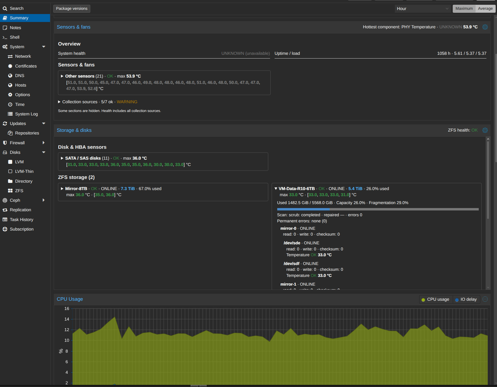
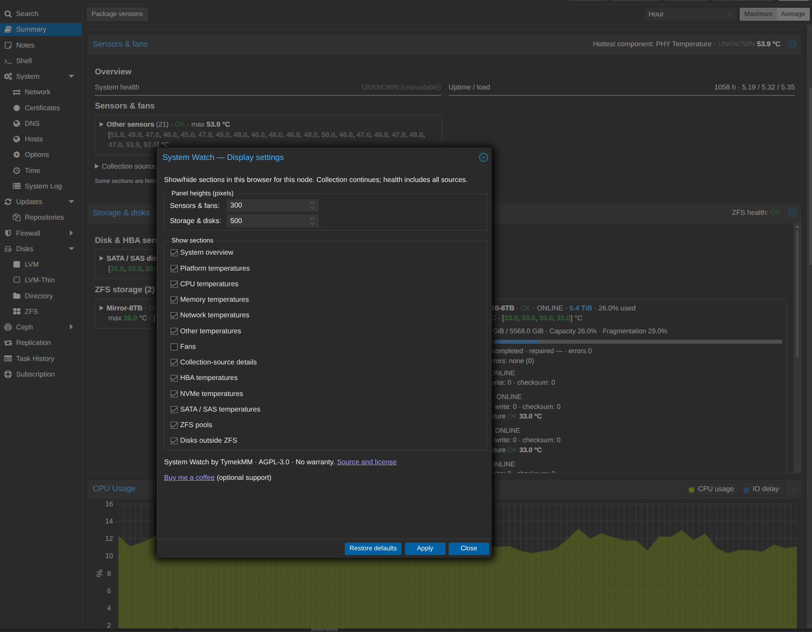

# System Watch for Proxmox VE

Hardware temperatures, fans, disks, and ZFS health directly in the Proxmox node Summary page.

System Watch runs a C# collector on each monitored host and displays its cached snapshot in two independently scrollable panels: **Sensors & fans** and **Storage & disks**. It does not change storage configuration, repair pools, or control fans.

**Free for personal and commercial use under the [GNU AGPL v3](LICENSE).** Donations are completely optional. This is an independent community project, not an official Proxmox product.

## Features

- CPU, motherboard, IPMI, NVMe, and SMART temperatures; available fan readings.
- ZFS pool health, capacity, usage, scrub information, and disk relationships.
- Disk capacities and temperatures, including disks outside ZFS.
- Independent source polling: slow SMART or IPMI collection does not block fast readings.
- Explicit stale/unavailable/error states rather than misleading green indicators.
- Browser-saved source visibility and panel heights; temperatures always use one decimal place.
- Guarded installation, original-file backups, UI-only and worker-only updates, and removal.

Display settings hide GUI content only; they do not disable collector modules. Settings are local to the browser and node, not a server-wide configuration.

## Screenshots

Real hardware readings in the Proxmox Summary page, with separate scrollable
panels for sensors and storage:

Expanded ZFS pool and disk details

Pool capacity, usage, scrub results, topology and individual disk temperatures.
Unavailable optional sources remain visibly unknown rather than appearing healthy.

Display settings

Choose visible sections and panel heights. Preferences are saved in this browser
for the selected node; collection continues independently of display settings.

## Compatibility

The initial recipes cover these reviewed `pve-manager` builds on Linux x64:

| Version | Reviewed running build | Live validation |
| --- | --- | --- |
| 9.2.10 | `43df2e01f27a1a19` | Installation, worker/API, and GUI |
| 9.2.20 | `49318c671b82f31e` | Installation, worker-only update, removal with verified original restoration, reinstallation, worker/API, and GUI |
| 9.2.21 | `4f6e0ac86f9e8c7f` | Upgrade repair from 9.2.10, worker/API, GUI, and UI-only update |

The installer also checks exact original file hashes and patch anchors. A matching version number alone is insufficient. Other builds are refused until a recipe has been reviewed. See [recipes](profiles/README.md).

A real 9.2.10 → 9.2.21 upgrade replaced both hooks while leaving the collector and UI asset installed. Guarded [repair](docs/repair.md) restored the integration without replacing the worker or UI. A separate UI-only update then installed the latest display settings footer. See the [9.2.21 validation record](docs/recipe-9.2.21-review.md). Clean installation on 9.2.21 has not yet been live-tested.

## Getting started

Use a release package from [GitHub Releases](https://github.com/TymekMM/system-watch-proxmox/releases), when available, or [build from source](docs/development.md). A self-contained package does not require .NET on the Proxmox host.

New to Linux or Proxmox? Start with the [step-by-step install, update and uninstall tutorial](docs/beginners-guide.md), including example output and explanations.

Follow the [installation guide](docs/installation.md): verify the package checksum, inspect a read-only plan, then install. Installation patches two Proxmox files and restarts `pvedaemon` and `pveproxy`; schedule it appropriately and keep SSH access available.

## Documentation

- [Beginner tutorial: download, install, check, update and uninstall](docs/beginners-guide.md)
- [AI assistant operations guide](AGENTS.md)

- [Installation, status, and removal](docs/installation.md)
- [Updating the GUI or worker](docs/updates.md)
- [Repairing hooks after a Proxmox upgrade](docs/repair.md)
- [Troubleshooting and Proxmox upgrades](docs/troubleshooting.md)
- [Building, tests, and architecture](docs/development.md)
- [Patch recipe format and candidate hashes](profiles/README.md)
- [Snapshot contract](docs/snapshot-contract.md)
- [Security reporting](SECURITY.md)

## Support development

If System Watch is useful to you, you can [buy TymekMM a coffee](https://buymeacoffee.com/tymekmm).

Donations support continued development and testing. They are optional, unlock no features, and do not purchase guaranteed support. Bug reports, documentation improvements, and reviewed compatibility recipes are welcome too.

## License and attribution

The existing AGPL-3.0 license is retained. See [LICENSE](LICENSE) and [THIRD-PARTY-NOTICES.md](THIRD-PARTY-NOTICES.md). Proxmox files and dependencies retain their own licenses. No full Proxmox vendor files are bundled with this project.
