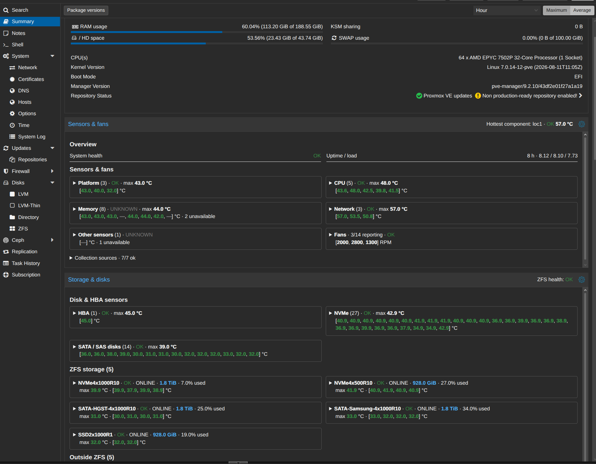

# Step-by-step guide: install, check, update and uninstall System Watch

This guide is for administrators new to Linux or moving from VMware or Windows
virtualization. You do not need to build software or install .NET on Proxmox.
You will download a ready-to-run Linux x64 package and use its C# manager.

Read one section, run its commands, and check the result before continuing.
**Do not paste this entire page into a terminal.**

## Contents

1. [Understand what changes](#1-understand-what-changes)
2. [Open a terminal on the correct node](#2-open-a-terminal-on-the-correct-node)
3. [Choose a release and download it](#3-choose-a-release-and-download-it)
4. [Verify and extract it](#4-verify-and-extract-it)
5. [Select the correct recipe](#5-select-the-correct-recipe)
6. [Check status and review the installation plan](#6-check-status-and-review-the-installation-plan)
7. [Install and check the GUI](#7-install-and-check-the-gui)
8. [Reconnect later](#8-reconnect-later)
9. [Download an update](#9-download-an-update)
10. [Update the GUI](#10-update-the-gui)
11. [Update the collector](#11-update-the-collector)
12. [Uninstall and verify restoration](#12-uninstall-and-verify-restoration)
13. [Handle a Proxmox upgrade](#13-handle-a-proxmox-upgrade)
14. [Understand common errors](#14-understand-common-errors)

### About the examples

Examples use the generic hostname `node-example` and a reviewed Proxmox 9.2.20
build. **Replace the hostname with your own node's short hostname.** Version
9.2.10 uses a different recipe; 9.2.21 has its own recipe too.

Output blocks are representative examples, not commands to paste. Lines containing
`<...>` or `...` abbreviate output or represent values that vary. Download
progress, hashes, timestamps, process IDs and service details can differ.
The manager success messages match the implementation. On 2026-10-02, the
public rc.2 archive was downloaded directly from GitHub on a reviewed 9.2.20
test VM; archive/internal checksums, worker update from rc.1, removal with both
originals compared byte for byte, and rc.2 reinstallation were verified. The
worker/API checks passed and the service was active and enabled. The earlier
rc.1 reinstall also had an operator browser check.
Clean installation and live removal on 9.2.21 have not yet been tested.

## 1. Understand what changes

System Watch runs on each monitored Proxmox node, because it reads that node's
hardware. Installation is not automatically distributed to other cluster nodes.

| Operation | What changes | Services restarted |
| --- | --- | --- |
| `plan install` | Nothing installed; prints a proposal | None |
| `install` | Backs up and patches two Proxmox files; installs worker, GUI, service and manifest | System Watch starts; `pvedaemon` and `pveproxy` restart |
| `status` | Nothing; checks recorded files | None |
| `plan ui-update` / `plan worker-update` | Nothing installed; prints a proposal | None |
| `ui-update` | Separate GUI asset and manifest | None |
| `worker-update` | Collector binary and manifest | System Watch only |
| `remove` | Restores recognized Proxmox originals and removes recognized project files; keeps backups | System Watch stops; `pvedaemon` and `pveproxy` restart |
| `repair` | Reapplies reviewed hooks after a Proxmox upgrade; refreshes backups and manifest | `pvedaemon` and `pveproxy` |

Install, remove and repair briefly interrupt Proxmox management/API access.
They do not issue VM stop commands, but schedule a suitable maintenance window
and avoid concurrent management jobs. Have a current host/VM backup appropriate
to your environment. Original-file backups are not a replacement for a host backup.

Only reviewed builds and exact vendor hashes are accepted. An unknown build
needs a reviewed recipe, not a forced installation.

## 2. Open a terminal on the correct node

The easiest route is the Proxmox web interface: select the **node**, then
**Shell**. Alternatively, use a terminal on your own computer:

```bash
ssh root@YOUR_PROXMOX_IP
```

Replace `YOUR_PROXMOX_IP` with the node's address. On first connection, verify
the server fingerprint through a trusted source before accepting it. At a
password prompt, typing produces no visible characters; type the password and
press Enter. Do not share it in screenshots or support requests.

A typical prompt is `root@node-example:~#`. It is not part of a command.
If you use SSH, keep this connection open during installation: the Proxmox
web Shell may reconnect when `pveproxy` restarts.

Check where you are:

```bash
whoami
hostname -s
uname -m
pveversion -v
```

Representative output:

```text
root
node-example
x86_64
proxmox-ve: 9.2.0 ...
pve-manager: 9.2.20 (running version: 9.2.20/49318c671b82f31e)
...
```

- `root` is the administrative account needed by the installer.
- `hostname -s` gives the short node name; write it down.
- `x86_64` matches the Linux x64 release. ARM hosts are not supported by this package.
- The `pve-manager:` line selects the recipe. The kernel version does not select it.

Confirm basic tools are present:

```bash
command -v curl tar sha256sum
```

Normally this prints three paths. If `curl` is missing, install it using the
standard Debian package manager, then repeat the check:

```bash
apt update
apt install curl
```

These commands update package indexes and install curl; they do not perform a
full Proxmox upgrade. `smartmontools` supplies SMART readings. `ipmitool` is
optional and only works with supported IPMI hardware. See
[requirements](installation.md#requirements); do not install optional hardware
tools merely to make every source appear green.

## 3. Choose a release and download it

Open [GitHub Releases](https://github.com/TymekMM/system-watch-proxmox/releases)
in your browser. Read the release notes, compatibility and known limitations.
Choose the release you intend to use. **A prerelease is a release candidate,
not a declaration that all installation paths have been tested.**

The worked example is `1.0.0-rc.2`. If a newer release is available, use its exact
version in the variable below and read its instructions. Do not use GitHub's
“Source code” archives for installation: those contain source, not ready binaries.
Download these two release assets:

- `system-watch-proxmox-VERSION-linux-x64.tar.gz`
- `system-watch-proxmox-VERSION-linux-x64.tar.gz.sha256`

On the **Proxmox node**, start a Bash session that stops after a failed command:

```bash
bash
set -euo pipefail
```

If a command fails, this session may exit. Stop and investigate; [section 8](#8-reconnect-later)
explains how to restore your variables after reconnecting. Do not continue with
unverified files.

Set the selected version and download both assets:

```bash
version=1.0.0-rc.2
archive="system-watch-proxmox-${version}-linux-x64.tar.gz"
base_url="https://github.com/TymekMM/system-watch-proxmox/releases/download/v${version}"
download_dir="/root/system-watch-downloads/$version"
mkdir -p "$download_dir"
cd "$download_dir"
curl --fail --location --output "$archive" "$base_url/$archive"
curl --fail --location --output "$archive.sha256" "$base_url/$archive.sha256"
ls -lh "$archive" "$archive.sha256"
```

`curl` downloads; `--location` follows GitHub's download redirect and `--fail`
rejects an HTTP error. `ls -lh` lists filenames and human-readable sizes. Expect
an archive around 62 MB and a small checksum text file for rc.2. A 404 means the
version/asset is wrong or unavailable; do not extract an error page.

## 4. Verify and extract it

First compare the download against the release checksum:

```bash
sha256sum -c "$archive.sha256"
```

Expected rc.2 output:

```text
system-watch-proxmox-1.0.0-rc.2-linux-x64.tar.gz: OK
```

`OK` means the archive's bytes match the checksum. For rc.2, the expected archive
SHA256 is `35b631abdcded4ec12b14f44f1841a6f37e2ec90c338a60a8f70d171e71c2709`.
That value belongs only to rc.2, not future releases. Checksums detect changed
bytes; they are not publisher signatures. Obtain the archive and expected
checksum from the intended project's release, not an untrusted repost.

Extract into a new version-specific directory, without overwriting an old release:

```bash
release_dir="/root/system-watch-releases/$version"
test ! -e "$release_dir"
mkdir -p "$release_dir"
tar -xzf "$download_dir/$archive" -C "$release_dir"
(cd "$release_dir" && sha256sum -c SHA256SUMS)
cat "$release_dir/BUILD-MANIFEST.txt"
```

`tar` unpacks the archive. The internal checks verify the files inside it.
Representative output, abbreviated:

```text
./AGENTS.md: OK
./assets/release-inputs.json: OK
./assets/system-watch-proxmox.service: OK
./assets/system-watch-ui.js: OK
./assets/SystemWatch.Worker: OK
./bin/SystemWatch.Management: OK
...
./profiles/pve-manager-9.2.20.json: OK
...
version=1.0.0-rc.2
source_revision=722535b6748e475f060bc857ab4aed7bfa9d7f1f
target=linux-x64
dotnet_sdk=10.0.112
worker_sha256=1f391bf07d45d2b063e89fe6c6edd6315ec061522d44c7489ec021f55d69a3e7
ui_sha256=b4c9313fba039dda3fefa42d9028ed12655ec304d13c9102859acc30a40f438d
unit_template_sha256=5b9e464f30d8c260c57c5c871137c606e1619d7215fb7c3fca859111839be73f
```

Every checked file must say `OK`. The manifest identifies the source commit and
package asset hashes. Its SDK entry describes how the release was built; you do
not need that SDK on Proxmox. Keep this directory for future updates/removal.
If `test ! -e` fails, the directory already exists: do not unpack a different
package over it. Reuse a previously verified release or choose a new empty path.

## 5. Select the correct recipe

For this 9.2.20 example, set:

```bash
node_name=node-example
recipe="$release_dir/profiles/pve-manager-9.2.20.json"
manager="$release_dir/bin/SystemWatch.Management"
test "$(hostname -s)" = "$node_name"
printf 'Node: %s\nRecipe: %s\nManager: %s\n' "$node_name" "$recipe" "$manager"
```

**Change `node-example` to the short hostname you checked in section 2.**
For 9.2.10 or 9.2.21, change the recipe filename accordingly. Do not select a
nearby version just because its number is similar. The installer verifies exact
file hashes as well as the running version.

Representative output:

```text
Node: node-example
Recipe: /root/system-watch-releases/1.0.0-rc.2/profiles/pve-manager-9.2.20.json
Manager: /root/system-watch-releases/1.0.0-rc.2/bin/SystemWatch.Management
```

These variables are shortcuts within this shell. They are not a saved installer
configuration. All file arguments must be absolute paths (starting with `/`).

## 6. Check status and review the installation plan

```bash
"$manager" status --profile "$recipe" --expected-host "$node_name"
```

On a clean host:

```text
Simple installation: clean
```

After an earlier recognized removal:

```text
Simple installation: clean (retained original backups)
```

If it says `file-complete`, System Watch is already present: use updates rather
than installing again. If it says `incomplete` or `drift`, stop and see
[troubleshooting](troubleshooting.md). Do not delete the manifest or overwrite
backups to make a plan succeed.

Now request the read-only plan:

```bash
"$manager" plan install \
  --profile "$recipe" --directory "$release_dir/assets" \
  --expected-host "$node_name"
```

Representative 9.2.20 rc.2 output (long hash fields abbreviated):

```text
Review plan for node-example pve-manager 9.2.20:
/usr/share/perl5/PVE/API2/Nodes.pm: <original hash> -> <candidate hash>; mode 0644; backup /var/lib/system-watch-proxmox/original-Nodes.pm
/usr/share/pve-manager/js/pvemanagerlib.js: <original hash> -> <candidate hash>; mode 0644; backup /var/lib/system-watch-proxmox/original-pvemanagerlib.js
/usr/share/pve-manager/js/system-watch-ui.js: absent -> <UI hash>; mode 0644; backup none
/opt/system-watch-proxmox/worker/SystemWatch.Worker: absent -> <worker hash>; mode 0700; backup none
/etc/systemd/system/system-watch-proxmox.service: absent -> <host-specific unit hash>; mode 0644; backup none
Both original Proxmox files are backed up before any target changes. One private manifest records these hashes.
Then publish worker, UI, unit, backend and frontend; reload systemd, start worker, restart pvedaemon and pveproxy, verify snapshot and API.
remove restores verified originals and retains backups. No file or service changed by plan.
```

- The first two files are Proxmox's API module and GUI bundle. `original` means
  before patching; `candidate` means the reviewed result after patching.
- The last three are project-owned files. `absent` means the target is vacant.
- A SHA256 identifies the complete file's bytes, not just the inserted lines.
- `0644` permits normal file reading; `0700` limits worker access to its owner.
  Original backups and the installation manifest are private to root.
- The rendered unit hash differs from the template hash because it binds your
  chosen hostname. This is expected.

Check that the node, version, target paths and backup locations are correct.
Nothing has been installed by the plan. If it refuses, do not run `install`.

## 7. Install and check the GUI

Run only after accepting the plan and scheduling the service restarts:

```bash
"$manager" install \
  --profile "$recipe" --directory "$release_dir/assets" \
  --expected-host "$node_name"
```

Successful output:

```text
Worker and authenticated API verified; check the Summary panel in a browser.
Installed and verified. Inspect the Summary panel in a browser.
```

Both originals are backed up and verified before installed targets change.
The manager starts the collector and verifies its snapshot/API, including
unauthenticated-request denial. It cannot check how your browser renders panels.
A failure triggers a guarded cleanup attempt; read its actual result and do not
assume rollback succeeded after a power failure or unknown external edits.

Check files and service:

```bash
"$manager" status --profile "$recipe" --expected-host "$node_name"
systemctl is-active system-watch-proxmox
systemctl is-enabled system-watch-proxmox
```

Expected output:

```text
Simple installation: file-complete (check service, API and browser separately)
active
enabled
```

`file-complete` means file hashes/modes match the manifest, not a complete live
health test. `active` means the service is running; `enabled` means systemd is
configured to start it at boot.

In the browser:

1. Open your Proxmox node's **Summary** page.
2. Hard-refresh it, usually **Ctrl+Shift+R** or **Ctrl+F5**.
3. Inspect **Sensors & fans** and **Storage & disks**, including scrolling.
4. Open the settings button, change a panel height or visible source, and confirm
   it takes effect. Preferences are local to this browser and node.
5. Allow slow probes time to collect. A VM may legitimately have no IPMI or HBA;
   grey/unavailable/error readings do not automatically mean installation failed.



For local diagnostics:

```bash
systemctl status system-watch-proxmox --no-pager
journalctl -u system-watch-proxmox -n 30 --no-pager
```

Look for `Active: active (running)` and recent log messages. If these commands
report a failed service, investigate rather than continuing to update/remove
blindly. Logs can contain private data; sanitize before sharing them.

## 8. Reconnect later

Shell variables disappear when you disconnect. On reconnect, select the installed
release and its recipe again. For the example above:

```bash
bash
set -euo pipefail
release_dir=/root/system-watch-releases/1.0.0-rc.2
node_name=node-example
recipe="$release_dir/profiles/pve-manager-9.2.20.json"
manager="$release_dir/bin/SystemWatch.Management"
test "$(hostname -s)" = "$node_name"
"$manager" status --profile "$recipe" --expected-host "$node_name"
```

Replace the hostname and paths with your own. Retain the recipe used to install:
the manifest pins its exact bytes, so an edited or different recipe may be refused.
After successful Proxmox upgrade repair, use the new recipe instead.

## 9. Download an update

An update is not another `install`. Choose which component you want to change:
GUI, collector, or both. Neither operation repatches Proxmox vendor files.

Select an actual newer release on GitHub. Repeat sections 3–4 with its version,
including both checksum checks. Keep the old release directory. Downloading and
extracting a new package does not update the installed software.

Then set separate installed and candidate paths (replace the candidate path
with the one you actually extracted):

```bash
installed_release=/root/system-watch-releases/1.0.0-rc.2
new_release=/absolute/path/to/the/verified/new/release
node_name=node-example
recipe="$installed_release/profiles/pve-manager-9.2.20.json"
manager="$new_release/bin/SystemWatch.Management"
test "$(hostname -s)" = "$node_name"
test -f "$new_release/BUILD-MANIFEST.txt"
"$manager" status --profile "$recipe" --expected-host "$node_name"
```

**Do not paste `/absolute/path/...` unchanged.** Use the actual new directory.
Use a manager compatible with the installed manifest and read the update's
release notes. The recipe stays the installed recipe; it is not automatically
replaced by an asset update. Set up each component below separately.

## 10. Update the GUI

Read the expected UI hash from the already verified candidate package manifest:

```bash
candidate="$new_release/assets/system-watch-ui.js"
candidate_hash=$(awk -F= '$1 == "ui_sha256" {print $2}' "$new_release/BUILD-MANIFEST.txt")
test "${#candidate_hash}" -eq 64
printf 'UI candidate: %s\nExpected SHA256: %s\n' "$candidate" "$candidate_hash"
"$manager" plan ui-update \
  --profile "$recipe" --asset "$candidate" --sha256 "$candidate_hash" \
  --expected-host "$node_name"
```

`awk` reads the recorded hash; it does not calculate a replacement hash to bypass
verification. The manager compares the asset against that expected value.
Representative output when the asset differs:

```text
UI asset: /usr/share/pve-manager/js/system-watch-ui.js
SHA256: <installed UI hash> -> <new UI hash>
Proxmox files, service unit and worker remain unchanged; no service restart.
Read-only UI update plan; no file or service changed.
```

If it says `UI update already installed`, the bytes are already present. Stop
this component's update; that refusal is not an installation failure. A release
can have a changed worker but an unchanged UI.

After reviewing a successful plan:

```bash
"$manager" ui-update \
  --profile "$recipe" --asset "$candidate" --sha256 "$candidate_hash" \
  --expected-host "$node_name"
```

The command prints the same asset/hash/service lines, followed by:

```text
UI asset and private manifest updated. Hard-refresh the browser to load it.
```

Hard-refresh Summary and check the new UI. No service restart is needed.
If necessary, use the same commands with a retained verified previous GUI asset
and its expected hash to restore that GUI. Do not overwrite the installed file
with `cp`; that would make the manifest inconsistent.

## 11. Update the collector

Read the worker hash from the verified candidate package:

```bash
candidate="$new_release/assets/SystemWatch.Worker"
candidate_hash=$(awk -F= '$1 == "worker_sha256" {print $2}' "$new_release/BUILD-MANIFEST.txt")
test "${#candidate_hash}" -eq 64
printf 'Worker candidate: %s\nExpected SHA256: %s\n' "$candidate" "$candidate_hash"
"$manager" plan worker-update \
  --profile "$recipe" --asset "$candidate" --sha256 "$candidate_hash" \
  --expected-host "$node_name"
```

Representative output:

```text
Worker: /opt/system-watch-proxmox/worker/SystemWatch.Worker
SHA256: <installed worker hash> -> <new worker hash>
Restart only system-watch-proxmox; verify a new worker instance and authenticated API.
Read-only worker update plan; no file or service changed.
```

`worker update already installed` means this component's bytes do not need an
update. If a successful plan proposes the desired change, apply it:

```bash
"$manager" worker-update \
  --profile "$recipe" --asset "$candidate" --sha256 "$candidate_hash" \
  --expected-host "$node_name"
"$manager" status --profile "$recipe" --expected-host "$node_name"
systemctl is-active system-watch-proxmox
```

After the asset/hash/service lines, successful output includes:

```text
Worker and authenticated API verified; check the Summary panel in a browser.
Worker and private manifest updated and verified.
Simple installation: file-complete (check service, API and browser separately)
active
```

Only the collector service restarts. On a caught failure, the manager attempts
to restore the previous binary/manifest and start the previous service. Read any
rollback message; an incomplete restoration needs inspection. Old release files
are useful for a reviewed rollback, and should be kept.

## 12. Uninstall and verify restoration

**This removes the panels and stops System Watch.** It does not uninstall
Proxmox, remove VMs or remove pools. It restarts Proxmox's affected services.
Run it only on the intended node, using the recipe matching its manifest.
If Proxmox was upgraded after installation, go to section 13 first.

Restore your installed variables as in section 8 if needed. Inspect status:

```bash
"$manager" status --profile "$recipe" --expected-host "$node_name"
```

A recognized completed installation reports `file-complete`. Removal can also
clean a recognized incomplete install, but unknown bytes or missing backups
must be investigated. There is no `plan remove` command.

Apply removal:

```bash
"$manager" remove --profile "$recipe" --expected-host "$node_name"
"$manager" status --profile "$recipe" --expected-host "$node_name"
```

Successful output:

```text
Recognized installation removed; original backups retained.
Simple installation: clean (retained original backups)
```

Check both restored files against the retained backups:

```bash
cmp /usr/share/perl5/PVE/API2/Nodes.pm /var/lib/system-watch-proxmox/original-Nodes.pm
cmp /usr/share/pve-manager/js/pvemanagerlib.js /var/lib/system-watch-proxmox/original-pvemanagerlib.js
sha256sum /usr/share/perl5/PVE/API2/Nodes.pm /usr/share/pve-manager/js/pvemanagerlib.js
```

`cmp` is silent when bytes are identical. A mismatch stops this shell; do not
continue. For the reviewed 9.2.20 originals, the hash output is:

```text
df97e542b4494513ab50dc23b8a87fb1ba3f0a749b5f4cbfb1f3565e32791fc6  /usr/share/perl5/PVE/API2/Nodes.pm
3e3fd5050fff6f40446d162cf4fb0aed6e8789b2e69e2e4e2cb43db644795cd7  /usr/share/pve-manager/js/pvemanagerlib.js
```

The 9.2.10/9.2.21 frontend hashes differ; compare against their matching recipe.
Hard-refresh the browser: the System Watch panels should disappear.
Backups remain under `/var/lib/system-watch-proxmox`; downloaded/extracted release
packages also remain. Keeping them is intentional. No `rm -rf` is needed.

To reinstall on the same reviewed build, run a new `plan install` and `install`
with the verified package. The clean retained backups are recognized.

## 13. Handle a Proxmox upgrade

A new Proxmox package may replace the patched files, so panels can disappear even
though the collector still runs. This is separate from a System Watch asset update.

The simplest planned route is to remove System Watch before upgrading Proxmox,
then install using a reviewed recipe for the new build. Preserve previous
packages/backups; do not delete old state just to make a new install succeed.
If old retained backups differ from the new build, consult the project before
cleaning them up. Do not let old backups overwrite upgraded vendor files.

If Proxmox has already been upgraded, use the supervised [repair guide](repair.md).
Download and verify the release with the new recipe. For an illustrative
9.2.10 → 9.2.21 repair, set actual retained paths:

```bash
previous_recipe=/absolute/path/to/installed-release/profiles/pve-manager-9.2.10.json
new_recipe=/absolute/path/to/verified-new-release/profiles/pve-manager-9.2.21.json
manager=/absolute/path/to/verified-new-release/bin/SystemWatch.Management
node_name=node-example
"$manager" plan repair \
  --profile "$new_recipe" --previous-profile "$previous_recipe" \
  --expected-host "$node_name"
```

Representative output, abbreviated:

```text
Repair node-example: 9.2.10 -> 9.2.21
/usr/share/perl5/PVE/API2/Nodes.pm: new original <hash> -> <candidate hash>
/usr/share/pve-manager/js/pvemanagerlib.js: new original <hash> -> <candidate hash>
Retain previous evidence; refresh both original backups and manifest; reapply vendor hooks.
Preserve worker, UI asset and service unit; restart pvedaemon and pveproxy; verify API.
Read-only repair plan; no file or service changed.
```

If the plan succeeds and its changes are accepted:

```bash
"$manager" repair \
  --profile "$new_recipe" --previous-profile "$previous_recipe" \
  --expected-host "$node_name"
recipe="$new_recipe"
"$manager" status --profile "$recipe" --expected-host "$node_name"
```

Representative successful output:

```text
Repair recovery evidence retained: /var/lib/system-watch-proxmox-history/<unique-directory>
Worker and authenticated API verified; check the Summary panel in a browser.
Hooks repaired and verified. Hard-refresh the browser.
Simple installation: file-complete (check service, API and browser separately)
```

Keep that evidence directory and use the **new recipe** for later operations.
Repair preserves your existing GUI and collector; use sections 10–11 if you also
want to update those components. A refused repair is not permission to restore
old originals over new vendor files. Power-loss recovery is manual.

## 14. Understand common errors

| Message or symptom | Meaning and next action |
| --- | --- |
| `curl: (22)` / HTTP 404 | Check the selected release tag and asset filename. Stop before extraction. |
| `FAILED` during checksum checking | Bytes differ. Download again from the intended release; do not replace the expected hash. |
| `No such file or directory` | Check the path and whether extraction succeeded. Recreate variables after reconnecting. |
| `recipe path must be absolute` | Use a full `/root/.../profiles/...json` path, not `profiles/...json`. |
| `usage: SystemWatch.Management ...` | Check spelling and argument order against this guide; preserve the order shown. |
| `file-complete` | File state is recognized; separately check the running service and browser. |
| `incomplete` | A recorded installation is partial. Inspect before using guarded removal. |
| `drift (...)` / unknown original | An expected recipe/file differs. Stop, check Proxmox version and read the detailed error. |
| Update already installed | That component already has the candidate bytes; skip its update. |
| Panels unchanged after UI update | Hard-refresh. Check display settings and the selected node. |
| Grey IPMI/HBA readings on a VM | Optional hardware/tools may be absent. Hide the display section if unwanted; no service change is needed. |

For support, record the release version, `pve-manager` line, command and error.
Do not paste passwords, tokens, serial numbers or complete private snapshots
into public issues. See [troubleshooting](troubleshooting.md) and the
[AI assistant guide](../AGENTS.md) for further help.
